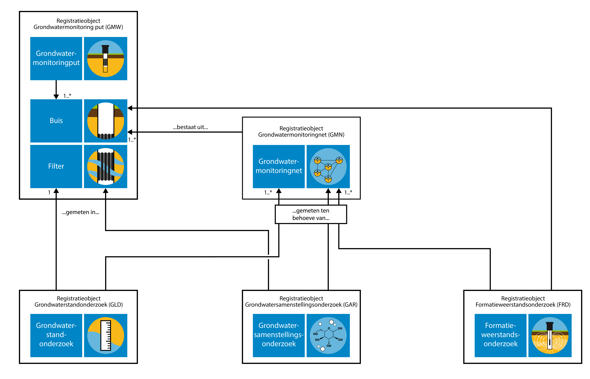

# Grondwatermonitoring

Grondwater is een belangrijke bestaansbron. Het grondwater wordt daarom in Nederland in de gaten gehouden en beheerd. Het beheer van het grondwater richt zich op de hoeveelheid bruikbaar grondwater en de kwaliteit ervan. Om dit beheer goed te kunnen uitvoeren, wordt in Nederland de toestand van het grondwater over langere tijd gevolgd. Dat heet grondwatermonitoring. Er wordt daarbij gekeken naar de grondwaterstand (kwantiteit), en naar de samenstelling van het grondwater (kwaliteit). Hiervoor worden grondwaterstandonderzoeken en grondwatersamenstellingsonderzoeken uitgevoerd.

In het domein grondwatermonitoring van de basisregistratie ondergrond staan de grondwatermonitoringnetten centraal die zijn ingesteld om het grondwater in Nederland te kunnen beheren. Het doel waarvoor een monitoringnet is ingesteld, het *monitoringdoel*, beperkt zich in veel gevallen tot kwantiteit of kwaliteit, maar het komt ook voor dat onderzoek aan zowel de kwantiteit als de kwaliteit wordt gedaan binnen hetzelfde grondwatermonitoringnet.

Grondwatermonitoring houdt in dat de toestand van het grondwater in een bepaald gebied, of eigenlijk in een bepaald deel van de ondergrond, over langere tijd gevolgd wordt. De grootte van het gebied en de diepte van monitoring verschillen per grondwatermonitoringnet. Ook de duur van monitoring wisselt sterk.

In het [Besluit basisregistratie ondergrond](https://zoek.officielebekendmakingen.nl/stb-2017-421.html) is omschreven welke vormen van monitoring onder deze basisregistratie vallen. Het belangrijkste criterium is het type organisatie dat verantwoordelijk is voor het beheer van het grondwater: de grondwatermonitoring moet door of in opdracht van een bestuursorgaan, de bronhouder, worden uitgevoerd. Verder is er een beperking aan de tijdschaal gesteld. Wanneer een monitoringnet is ingesteld om de toestand van het grondwater over een periode van ten minste één jaar te volgen, dan valt het altijd onder de basisregistratie ondergrond. Voor monitoringnetten met een kortere duur maakt het bestuursorgaan zelf de afweging of de gegevens in de basisregistratie moeten worden opgenomen. De periode van een jaar is lang genoeg voor het uitfilteren van de effecten van kleinschalige en kortdurende invloeden, zodat de informatie die in de basisregistratie wordt vastgelegd blijvende gebruikswaarde heeft. Aan de ruimtelijke schaal van monitoring zijn voor de basisregistratie ondergrond geen grenzen gesteld anders dan geldt voor de gehele basisregistratie ondergrond, namelijk dat die gegevens bevat over de ondergrond van Nederland en zijn Exclusieve Economische Zone (EEZ). De EEZ is het gebied op de Noordzee waar Nederland economische rechten heeft.

In de [Regels omtrent de basisregistratie ondergrond](https://zoek.officielebekendmakingen.nl/kst-33839-3.html) en het [Besluit basisregistratie ondergrond](https://zoek.officielebekendmakingen.nl/stb-2017-421.html) staat dat de basisregistratie ondergrond vooralsnog geen milieukwaliteitinformatie bevat. Voor het grondwatermonitoringdomein zijn monitoringnetten rondom milieuhygiënische projecten, waarin het met name gaat om het monitoren van de verontreiniging van de bodem en het grondwater, daarmee voorlopig buiten scope geplaatst. Op 18 december 2018 is in de Tweede Kamer een [motie (Kamerstuk 34864-19)](https://zoek.officielebekendmakingen.nl/kst-34864-19) aangenomen waarin de regering wordt verzocht “om informatie over bodemverontreiniging in de basisregistratie ondergrond op te nemen”. Op het moment van publiceren van deze catalogus is nog niet bekend wat de gevolgen van deze motie zullen zijn voor de scope van het registratieobject Grondwatermonitoringnet.

De monitoring van de kwaliteit van de ondiepe bodem met het daarin aanwezige grondwater (bodemvocht), zoals dat gedaan wordt om de gevolgen van met name landbouwactiviteiten te kunnen volgen, valt buiten de scope van het registratieobject Grondwatermonitoringnet. De volledige scopeafbakening is beschreven in het [Scopedocument grondwatermonitoringnet GMN](https://basisregistratieondergrond.nl/inhoud-bro/registratieobjecten/grondwatermonitoring/grondwatermonitoringnet-gmn/).

# Domein grondwatermonitoring in de basisregistratie ondergrond

Het domein grondwatermonitoring in de basisregistratie ondergrond omvat de volgende vijf registratieobjecten:

- Grondwatermonitoringnet;
- Grondwatermonitoringput;
- Grondwatersamenstellingsonderzoek (grondwaterkwaliteit);
- Grondwaterstandonderzoek (grondwaterkwantiteit);
- Formatieweerstandonderzoek (grondwaterkwaliteit).

In de voorliggende catalogus gaat het over het registratieobject Grondwatermonitoringnet.

In de technische landelijke voorziening van de basisregistratie ondergrond worden Engelstalige benamingen gehanteerd voor de registratieobjecten. Omwille van de aansluiting hiermee worden voor de registratieobjecten Engelstalige afkortingen gebruikt. In deze catalogus worden alleen Engelstalige afkortingen en de Nederlandstalige termen gebruiken.

- Grondwatermonitoringnet wordt afgekort tot GMN (Groundwater Monitoring Network);
- Grondwatermonitoringput wordt afgekort tot GMW (Groundwater Monitoring Well);
- Grondwatersamenstellingsonderzoek wordt afgekort tot GAR (Groundwater Analysis Report);
- Grondwaterstandonderzoek wordt afgekort tot GLD (Groundwater Level Dossier);
- Formatieweerstandonderzoek wordt afgekort tot FRD (Formation Resistance Dossier).

<figure id='plaatje-grondwaterdomein'>
    
    <figcaption>De samenhang tussen de vijf registratieobjecten binnen het domein grondwatermonitoring.</figcaption>
</figure>

Een grondwatermonitoringput betreft de putconstructie die gebruikt wordt om standen en/of de samenstelling van het grondwater te meten. Gewoonlijk bestaat een put uit een samenstel van buizen dat aan het oppervlak wordt beschermd tegen invloeden van buitenaf. Via de buizen wordt het grondwater dat zich op een bepaalde diepte bevindt ontsloten. Het deel van de buis waardoor het grondwater binnen kan komen is het filter. Elke buis heeft één filter. Een filter fungeert als meetpunt in de basisregistratie ondergrond. Informatie over grondwatermonitoringput is beschreven in de [Catalogus Grondwatermonitoringput](https://basisregistratieondergrond.nl/inhoud-bro/registratieobjecten/grondwatermonitoring/grondwatermonitoringput-gmw/).

In bepaalde delen van Nederland worden bij inrichting van de put soms geo-ohmkabels aan een buis bevestigd. Dit zijn kabels die voorzien zijn van elektroden en aangesloten kunnen worden op een meetkastje. De kabels worden traditioneel gebruikt om de elektrische weerstand van de formatie te kunnen monitoren. De weerstand is een indicatie voor het zoutgehalte. Vroeger werden de geo-ohmkabels daarom wel zoutwachters genoemd. De elektroden vormen per paar een meetpunt.

Binnen het grondwaterdomein in de basisregistratie ondergrond kent alleen de grondwatermonitoringput een fysieke locatie. De vier andere registratieobjecten zijn aan het registratieobject grondwatermonitoringsput gekoppeld en hebben daarmee indirect een locatie. Bij grondwaterstandonderzoeken, grondwatersamenstellingsonderzoeken en formatieweerstandsonderzoeken, ligt de verwijzing vast naar het filter of respectievelijk elektrodes van de monitoringbuis in de grondwatermonitoringput waarin het onderzoek is uitgevoerd. Daarnaast ligt bij grondwaterstandonderzoeken, grondwatersamenstellingsonderzoeken en formatieweerstandsonderzoeken, de verwijzing vast naar één of meerdere grondwatermonitoringnetten ten behoeve waarvan het onderzoek is uitgevoerd.

Een grondwatermonitoringnet is een verzameling locaties waar, voor een bepaald monitoringdoel met een bepaald wettelijk kader, periodiek onderzoek aan het grondwater op een bepaalde diepte wordt gedaan om de toestand van het grondwater te kunnen bepalen en de eventuele veranderingen erin te kunnen volgen. Het grondwatermonitoringnet weerspiegelt de groepering van onderzoeksgegevens door de bronhouder op basis van het doel van de monitoring. Het registratieobject vergroot daarmee de hergebruikswaarde voor afnemers van de gegevens van de basisregistratie ondergrond.

Een grondwatermonitoringnet valt onder de verantwoordelijkheid van één bronhouder en heeft een vastgesteld monitoringdoel. In de praktijk kan het voorkomen dat een formatieweerstandonderzoek ten behoeve van meer dan één doel wordt uitgevoerd. Omdat er voor afzonderlijke monitoringdoelen verschillende grondwatermonitoringnetten zijn, betekent dit voor de basisregistratie ondergrond dat grondwaterstandsonderzoeken, grondwatersamenstellingsonderzoeken of formatieweerstandonderzoeken kunnen toebehoren aan één of meerdere grondwatermonitoringnetten.

Op de website basisregistratie ondergrond is meer informatie te vinden over [grondwatersamenstellingsonderzoek](https://basisregistratieondergrond.nl/inhoud-bro/registratieobjecten/grondwatermonitoring/grondwatersamenstellingsonderzoek-gar/), [grondwaterstandonderzoek](https://basisregistratieondergrond.nl/inhoud-bro/registratieobjecten/grondwatermonitoring/grondwaterstandonderzoek-gld/) en [formatieweerstandonderzoek](https://basisregistratieondergrond.nl/inhoud-bro/registratieobjecten/grondwatermonitoring/formatieweerstandonderzoek-frd/).

# Wettelijk kader en monitoringdoel

Met het registratieobject Grondwatermonitoringnet wordt de groepering van samenhangende onderzoeksgegevens, namelijk van onderzoeken die vanuit hetzelfde bepaalde doel zijn uitgevoerd, tot een gegevensset gefaciliteerd. Naast de (her)gebruikswaarde van de afzonderlijke onderzoeksgegevens, ontstaat hiermee toegevoegde (her)gebruikswaarde door groepering in een gegevensset. Bestuursorganen en andere gebruikers worden met deze gegevenssets in staat gesteld om huidige en toekomstige geohydrologische vraagstukken beter en efficiënter te beantwoorden.

Een grondwateronderzoek kan ten behoeve van meer dan één monitoringdoel uitgevoerd worden: een onderzoek kan in het kader van meerdere grondwatermonitoringnetten tegelijk zijn uitgevoerd, en dus deel uitmaken van meerdere gegevenssets. In het registratieobject Grondwatermonitoringnet worden daartoe het doel van de monitoring (*monitoringdoel*) vastgelegd en het wettelijk kader waar dit doel uit volgt (*kader aanlevering*). In de <a href="#wettelijk-kader-en-doel">bijlage</a> is een overzicht opgenomen van de wettelijke kaders en de daarbij behorende monitoringdoelen.

Bij de registratieobjecten Grondwatersamenstellingsonderzoek en Grondwaterstandonderzoek wordt vastgelegd ten behoeve van welk(e) monitoringnet(ten) het onderzoek is uitgevoerd. Het *kader aanlevering* van een grondwatermonitoringnet geldt daarmee ook voor de aan het monitoringnet gekoppelde onderzoeken.

De wettelijke kaders waarbinnen grondwatermonitoring plaatsvindt, staan in de codelijst KaderAanlevering. In deze codelijst zijn alleen wetten opgenomen die op dit moment in werking zijn. Er wordt op dit moment gewerkt aan de Omgevingswet. Het is de ambitie om verschillende wetten die in de codelijst KaderAanlevering staan, waaronder de Waterwet, de Wet natuurbescherming en de Ontgrondingenwet, te laten opgaan in de Omgevingswet. De Omgevingswet is nog niet in werking getreden, en is daarom niet opgenomen in de codelijst KaderAanlevering.

In de basisregistratie ondergrond ligt alleen de huidige rechtsgrond vast op basis waarvan de monitoring plaatsvindt. Aangezien de wetgeving kan veranderen gedurende de periode van monitoren, terwijl het monitoringdoel gelijk kan blijven, geldt dat de rechtsgrond gedurende de levensduur van het grondwatermonitoringnet kan veranderen. In dat geval geeft de bronhouder de nieuwe waarde voor *kader aanlevering* door, en vervangt dit de waarde die op dat moment vastligt. In de basisregistratie ondergrond ligt van *kader aanlevering* alleen de huidige waarde vast; er wordt van dit gegeven geen materiële geschiedenis bijgehouden.

# Meetpunten

Om aan te geven op welke locaties er onderzoek wordt gedaan ten behoeve van het monitoringdoel, ligt bij een grondwatermonitoringnet vast welke meetpunten onderdeel zijn van het net. Een meetpunt wordt gevormd door een filter dat zich in een monitoringbuis van een grondwatermonitoringput bevindt. In de basisregistratie ondergrond wordt de verwijzing naar deze monitoringbuis vastgelegd door middel van het *BRO-ID* van de grondwatermonitoringput en het *buisnummer*. Het grondwatermonitoringnet en de grondwatermonitoringputten kunnen overigens verschillende bronhouders hebben.

Het meetpunt wordt binnen de basisregistratie ondergrond geïdentificeerd door de *meetpuntcode*. Deze code is uniek binnen het grondwatermonitoringnet en wordt door de bronhouder bepaald en aangeleverd.

De verzameling meetpunten geeft de samenstelling van het grondwatermonitoringnet weer, en geeft inzicht in het gebied waarin wordt gemonitord. De verzameling meetpunten waaruit het monitoringnet bestaat, kan veranderen in de tijd: de verzameling meetpunten kan worden uitgebreid en/of ingekrompen. In de tijd kunnen ook meetpunten zelf veranderen: een meetpunt kan opeenvolgend gevormd worden door verschillende, in buizen aanwezige filters. Deze filters kunnen onderdeel zijn van verschillende grondwatermonitoringputten. Bijvoorbeeld wanneer een filter verstopt raakt of de put kapot gaat en vervangen wordt door een nieuwe put. Als de bronhouder van een grondwatermonitoringnet de vervangende put en de daarin aanwezige buis met filter met het oog op het monitoringdoel van het monitoringnet beschouwt als voldoende vergelijkbaar met het oude filter (in de voorgaande put), dan kan hij ervoor kiezen om het meetpunt voort te zetten met het vervangende filter in de buis van de (vervangende) put.

Om de geohydrologische context te kunnen begrijpen, moet de gebruiker van de basisregistratie ondergrond de volledige, door de bronhouder gedefinieerde, gegevensset van een grondwatermonitoringnet kunnen raadplegen. Voor optimale herbruikbaarheid is het daarom nodig dat deze verzameling van meetpunten volledig en juist in de basisregistratie ondergrond wordt vastgelegd. Om het aanleveren van gegevens van de verschillende registratieobjecten in het grondwaterdomein gemakkelijker te maken is het niet verplicht om deze gegevens meteen bij registratie volledig aan te leveren. Bij een grondwatermonitoringnet moet wel altijd minstens één koppeling zijn met een monitoringbuis van een grondwatermonitoringput als meetpunt, zodat het grondwatermonitoringnet op elk moment in de tijd via een gekoppelde grondwatermonitoringput gerelateerd kan worden aan een locatie. De verzameling van meetpunten kan eventueel na registratie van het grondwatermonitoringnet op een later moment compleet gemaakt worden.

## Aanduiding *buis in gebruik* in Grondwatermonitoringput

In het registratieobject Grondwatermonitoringput ligt voor elke buis in de put vast of het filter in die buis in gebruik is (attribuut *buis in gebruik*). Deze aanduiding geeft aan of het filter van de monitoringbuis een actueel meetpunt vormt in een grondwatermonitoringnet. Een filter vormt een actueel meetpunt als er binnen één of meerdere grondwatermonitoringnetten op de huidige datum een meetpunt is dat naar de betreffende buis in de put verwijst. Het al dan niet gekoppeld zijn van grondwatersamenstellingsonderzoeken of grondwaterstandonderzoeken aan de betreffende buis van de put is niet van invloed op de waarde van *buis in gebruik*.

De waarde van het attribuut *buis in gebruik* wordt door de basisregistratie ondergrond afgeleid. Dit wordt niet door een bronhouder aangeleverd. Wanneer de gegevens van de buis worden aangeleverd aan de basisregistratie ondergrond in het registratieobject Grondwatermonitoringput, krijgt *buis in gebruik* initieel de waarde 'onbekend'. Wanneer een bronhouder een verandering doorgeeft in een meetpunt van een monitoringnet, dan past de basisregistratie ondergrond, als dat nodig is, ook de waarde van *buis in gebruik* aan voor de betreffende buis in de grondwatermonitoringput. Dit zorgt ervoor dat *buis in gebruik* op 'ja' staat wanneer er binnen één of meerdere grondwatermonitoringnetten op de huidige datum een meetpunt is dat naar de betreffende buis in de put verwijst. Het staat op 'nee' wanneer dit niet het geval is.

# Object met een levensloop

Het grondwatermonitoringnet is een object met een levensloop. Een grondwatermonitoringnet bestaat voor langere tijd, en tijdens zijn bestaan kunnen veranderingen optreden die geregistreerd moeten worden in de basisregistratie ondergrond. Registratie van gegevens van een grondwatermonitoringnet is dus geen eenmalige gebeurtenis, maar een proces dat zo lang duurt als het grondwatermonitoringnet bestaat. De levensloop van een grondwatermonitoringnet heeft een begin en een eind, en loopt gelijk met de periode waarin wordt gemonitord.

De *monitoringnetgeschiedenis* bevat het geheel van gebeurtenissen dat de geschiedenis van het monitoringnet in de werkelijkheid beschrijft: de monitoringgeschiedenis geeft aan wat de begindatum van monitoring is, wat de einddatum van monitoring is en welke gebeurtenissen er tussentijds hebben plaatsgevonden.

Bij het registreren van het grondwatermonitoringnet geeft de bronhouder de *begindatum monitoring* op. Wanneer de reeds bestaande monitoringnetten voor het eerst in de basisregistratie ondergrond geregistreerd worden, zal de begindatum voor deze monitoringnetten in het verleden liggen.

Tot het moment van beëindigen blijft een grondwatermonitoringnet vanuit het oogpunt van de basisregistratie ondergrond actief. Ook als er gedurende enige of langere tijd geen grondwatersamenstellingsonderzoeken aan gekoppeld worden, of lopende grondwaterstandonderzoeken aan gekoppeld zijn. Bij het eindigen van het monitoren binnen een bepaald grondwatermonitoringnet geeft de bronhouder de *einddatum monitoring* op. De gegevens van het grondwatermonitoringnet en de onderzoeken die eraan gekoppeld zijn blijven na die einddatum opvraagbaar voor gebruikers.

Wanneer zich gedurende de levensloop van een grondwatermonitoringnet een relevante verandering voordoet, worden de nieuwe gegevens aangeboden aan de basisregistratie ondergrond. Deze veranderingen worden vastgelegd als *Tussentijdse gebeurtenis*. Van elke tussentijdse gebeurtenis wordt de *naam gebeurtenis* en de *datum gebeurtenis* vastgelegd. Tussentijds kan de verzameling meetpunten veranderen; er kunnen meetpunten bijkomen (*meetpuntToevoegen*) en afvallen (*meetpuntBeëindigen*). Dit betekent dat van elk meetpunt de begin- en de einddatum wordt vastgelegd. Deze informatie is ook opvraagbaar voor gebruikers.

Bij een meetpunt kan tevens de verwijzing naar de monitoringbuis in de grondwatermonitoringput wijzigen (*monitoringbuisVervangen*), zie . De vervangingsdatum van de, aan het meetpunt gekoppelde monitoringbuis in een put, wordt vastgelegd en is daarmee door gebruikers opvraagbaar. Een meetpunt moet altijd een verwijzing naar een monitoringbuis in een put bevatten. De registratie van de tussentijdse gebeurtenis monitoringbuisVervangen kan daarom pas plaatsvinden nadat de grondwatermonitoringput en de monitoringbuis zijn geregistreerd in de basisregistratie ondergrond.

In de registratiegeschiedenis van elk registratieobject ligt vast sinds wanneer het is geregistreerd in de basisregistratie ondergrond (*tijdstip registratie object*) en wanneer de registratie is voltooid (*tijdstip voltooiing registratie*). Dit is onderdeel van de formele geschiedenis van het registratieobject. De *begindatum* en *einddatum monitoring* van het monitoringnet kunnen andere datums zijn dan de datums in de formele geschiedenis. De begin- en einddatum monitoring zijn onderdeel van de *monitoringnetgeschiedenis*. De monitoringnetgeschiedenis vormt de materiële geschiedenis van het registratieobject. Voor uitleg over materiële en formele geschiedenis van objecten, zie .

# Kwaliteit en kwantiteit

In het kader van een grondwatermonitoringnet wordt onderzoek gedaan naar de kwaliteit of kwantiteit van het grondwater. Het komt ook voor dat er onderzoeken worden uitgevoerd naar beide grondwateraspecten: zowel de kwaliteit als de kwantiteit. In dat geval is wel altijd één van beide grondwateraspecten primair, en vinden er ondersteunend ook onderzoeken aan het andere aspect plaats. Bijvoorbeeld: in sommige monitoringnetten voor kwantiteit worden ook chloridegehaltes gemeten ten behoeve van eventuele correcties (“zoutcorrecties”).

Voor de aspecten kwaliteit en kwantiteit zijn er afzonderlijke monitoringdoelen. In het geval dat er in het kader van het grondwatermonitoringnet metingen aan zowel de kwaliteit als de kwantiteit worden gedaan, wordt het monitoringdoel bij het primaire, meest belangrijke aspect vastgelegd in de basisregistratie ondergrond. Naast onderzoeken aan het primaire grondwateraspect, kunnen er ook onderzoeken aan het andere aspect gekoppeld zijn aan het grondwatermonitoringnet. Bijvoorbeeld: aan een grondwatermonitoringnet waarin primair het aspect kwantiteit wordt gemonitord, kunnen naast grondwaterstandonderzoeken ook grondwatersamenstellingsonderzoeken gekoppeld worden.

In de basisregistratie ondergrond wordt, naast het *monitoringdoel*, het *grondwateraspect* ook in een eigen attribuut vastgelegd. De gebruiker kan hierdoor grondwatermonitoringnetten selecteren op basis van het aspect dat gemonitord wordt: kwaliteit of kwantiteit.

# Kwaliteitsregime IMBRO/A

Een belangrijk aandachtspunt in het domein grondwatermonitoring is het in de basisregistratie ondergrond registreren van historische onderzoeksgegevens van grondwaterkwaliteit en grondwaterstanden. Deze zijn mogelijk niet onder te brengen in een scherp gedefinieerd monitoringnet met bijbehorend wettelijk kader conform de eisen van kwaliteitsregime IMBRO.

Voor historische onderzoeksgegevens zijn het wettelijk kader en het monitoringdoel niet altijd bekend. Deze historische gegevens kunnen aan een grondwatermonitoringnet gekoppeld worden met kwaliteitsregime IMBRO/A. Grondwatermonitoringnetten onder kwaliteitsregime IMBRO/A zijn bedoeld als administratieve oplossing om in de basisregistratie ondergrond historische onderzoeksgegevens, bijvoorbeeld uit archiefoverdracht, te kunnen registreren waarvan niet (meer) bekend is binnen welk(e) monitoringnet(ten) deze tot stand zijn gekomen. Onder kwaliteitsregime IMBRO/A is het daarom mogelijk om grondwatermonitoringnetten te definiëren zonder specifiek wettelijk kader (kader aanlevering 'archiefoverdracht') en zonder specifiek monitoringdoel (monitoringdoel 'onbekend'). Wanneer het monitoringdoel 'onbekend' opgegeven is, kan de bronhouder er daarnaast voor kiezen om het grondwateraspect 'onbekend' vast te leggen, in plaats van specifiek 'kwaliteit' of 'kwantiteit'.

Grondwatermonitoringnetten onder IMBRO/A moeten altijd betrekking hebben op een periode in het verleden: bij registratie geeft de bronhouder een *einddatum monitoring* in het verleden op, of anders een *einddatum monitoring* met de waarde 'onbekend'.

# Samenhang en consistentie tussen verschillende registratieobjecten in het grondwaterdomein

De verschillende registratieobjecten in het grondwaterdomein en hun gegevens hebben samenhang. Zie de beschrijving hiervan in , en de beschrijving over het gegeven *buis in gebruik* in .

Op basis van de samenhang wordt er consistentie verwacht tussen de gegevens in verschillende registratieobjecten in het grondwaterdomein. Het is de verantwoordelijkheid van de bronhouder om deze consistentie te waarborgen. De basisregistratie ondergrond dwingt dit grotendeels niet af, behalve op het gebied van verwijzingen zoals hieronder beschreven.

De basisregistratie ondergrond dwingt alleen af dat gegevens in andere registratieobjecten waarnaar verwezen wordt, ook daadwerkelijk geregistreerd zijn. Dit geldt voor de volgende verwijzingen (zie ook het plaatje in ):

- Vanuit Grondwatermonitoringnet, Grondwatersamenstellingsonderzoek en Grondwaterstandonderzoek naar een monitoringbuis in een grondwatermonitoringput.
- Vanuit Grondwatersamenstellingsonderzoek en Grondwaterstandonderzoek naar Grondwatermonitoringnet.

Daarnaast wordt op de volgende punten consistentie verwacht:

- De verzameling meetpunten binnen een grondwatermonitoringnet is consistent met de grondwatersamenstellingsonderzoeken en grondwaterstandonderzoeken die in het kader van het monitoringnet zijn uitgevoerd. Dat wil zeggen: ten tijde van het uitvoeren van het onderzoek vormt de monitoringbuis in de put waarin het onderzoek plaatsvindt, een meetpunt in elk grondwatermonitoringnet waaraan het betreffende onderzoek gekoppeld is.

Ook met betrekking tot kwaliteitsregime geldt een specifieke samenhang tussen gegevens van verschillende registratieobjecten.

- Aan een grondwatermonitoringnet dat onder kwaliteitsregime IMBRO/A in de basisregistratie is geregistreerd kunnen alleen onderzoeksgegevens (grondwatersamenstellingsonderzoeken en/of grondwaterstandonderzoeken) gekoppeld worden die ook onder kwaliteitsregime IMBRO/A vallen. Van grondwatersamenstellingsonderzoeken en grondwaterstandonderzoeken onder kwaliteitsregime IMBRO moet bekend zijn in welk (wettelijk) kader ze zijn uitgevoerd. Daarom kunnen ze alleen gekoppeld worden aan grondwatermonitoringnetten die onder kwaliteitsregime IMBRO zijn geregistreerd. Grondwatersamenstellingsonderzoeken en grondwaterstandonderzoeken onder kwaliteitsregime IMBRO/A kunnen zowel gekoppeld worden aan grondwatermonitoringnetten onder kwaliteitsregime IMBRO als onder IMBRO/A.
- Voor de verwijzingen naar grondwatermonitoringput vanuit andere registratieobjecten gelden geen restricties. Het maakt niet uit of de grondwatermonitoringput waarnaar verwezen wordt kwaliteitsregime IMBRO of IMBRO/A heeft.

## Buiten scope

Binnen het geheel van grondwatersamenstellingsonderzoeken die gekoppeld zijn aan een grondwatermonitoringnet, wordt soms nog een verdere groepering onderkend in meetrondes. In een *meetronde* wordt samenhang aangebracht tussen grondwatersamenstellingsonderzoeken die in dezelfde periode zijn uitgevoerd in verschillende meetpunten. Deze zijn door de bronhouder bedoeld om een samenhangende gegevensset te vormen. Het concept meetronde is niet opgenomen in de basisregistratie ondergrond, en maakt dus geen deel uit van het registratieobject Grondwatermonitoringnet.

# INSPIRE

Het doel van de Europese kaderrichtlijn [INSPIRE](https://inspire.ec.europa.eu/) is het harmoniseren en openbaar maken van ruimtelijke gegevens van overheidsorganisaties ten behoeve van het milieubeleid. Het registratieobject Grondwatermonitoringnet valt onder het INSPIRE-thema Environmental monitoring facilities, en om die reden moeten de gegevens in het registratieobject geschikt gemaakt worden voor uitwisseling volgens de INSPIRE-standaard. Dit wordt voor dit registratieobject geïmplementeerd middels een mapping van het gegevensmodel van het registratieobject Grondwatermonitoringnet op het gegevensmodel van het INSPIRE-thema. De inhoud van deze mapping is geen onderdeel van deze catalogus.
